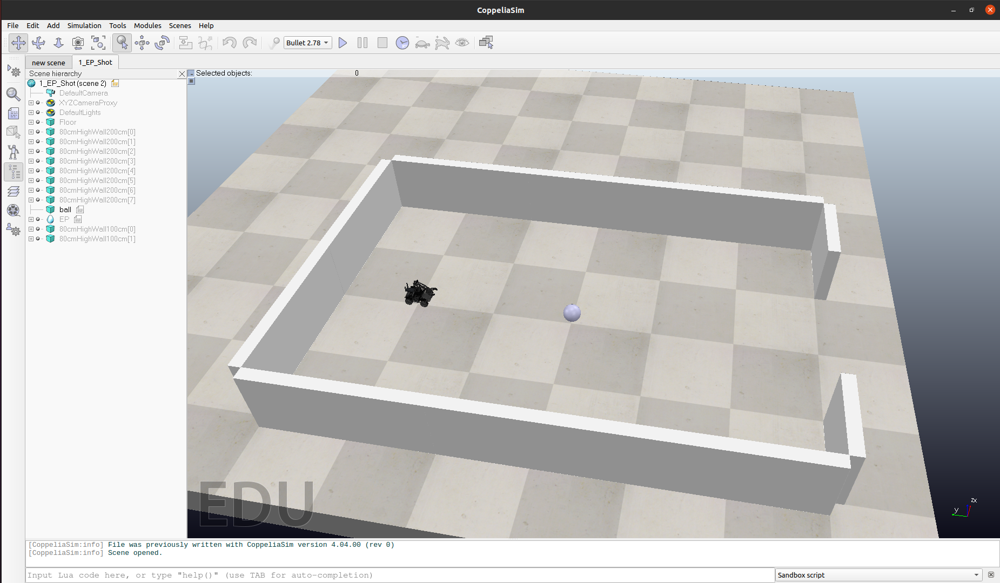

# Robot Soccer Game Environment

A robot soccer game simulation environment based on CoppeliaSim.


## How to Run

I tested on the below environment.

- Ubuntu 20.04
- Python 3.8
- PyTorch 1.11.0

### Installation

- CoppeliaSim

  Refer to `Installation` and `Build` part of [robomaster_sim](https://github.com/jeguzzi/robomaster_sim#installation). CoppeliaSim Edu 4.4.0 is recommended.

- Python Packages

  > A virtual environment `venv` is recommended ( Anaconda is not recommended).

  - RoboMaster: Refer to [Robomaster SDK](https://github.com/jeguzzi/robomaster_ros#robomaster-sdk). 

  - Gym: 

    ```shell
    pip install gym[all]
    ```

  - PyTorch: >=1.11

  - (optional) stable baselines 3:

    ```shell
    pip install stable-baselines3[extra]
    ```


## Test

### CoppeliaSim

1. Start CoppeliaSim in your folder
```shell
./CoppeliaSim_Edu_V4_4_0_rev0_Ubuntu20_04/coppeliasim.sh
```
2. Open simulation scene `1_EP_Shot.ttt`.

   

3. IP alias
```shell
sudo ifconfig lo:0 127.0.1.1/8 up
sudo ifconfig lo:1 127.0.1.2/8 up
sudo ifconfig lo:2 127.0.1.3/8 up
```
4. Press PLAY in CoppeliaSim.
5. Try this to test if everything in CoppeliaSim is fine.
```lua
simRobomaster.set_target_twist(0, {x=0.2, y=-0.1, theta=0.1})
simRobomaster.move_arm(0, 1, 1, true)
simRobomaster.open_gripper(int robot_handle, bool wait=true)
simRobomaster.close_gripper(int robot_handle, bool wait=true)
simRobomaster.set_gripper_target(int handle, string state, float power=0.5)
```
6. Run the python script `simpleTest.py` in `CoppeliaSim` folder to test if everything is fine.

### GymEnv

Just run `test.py` in `GymEnv` to test.


## Attached


### [CoppeliaSim remote API](https://www.coppeliarobotics.com/helpFiles/en/remoteApiFunctionsPython.htm)

Some commonly used functions are in *CoppeliaSim Legacy remote API.pdf*.

### RoboMaster API
https://robomaster-dev.readthedocs.io/zh_CN/latest/index.html


